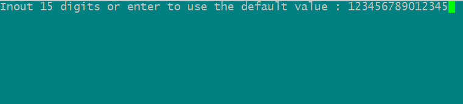
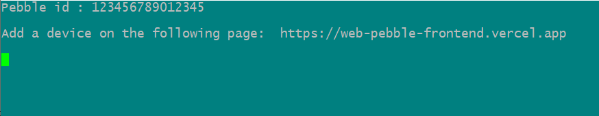
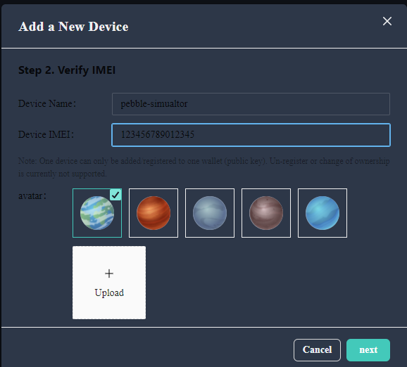
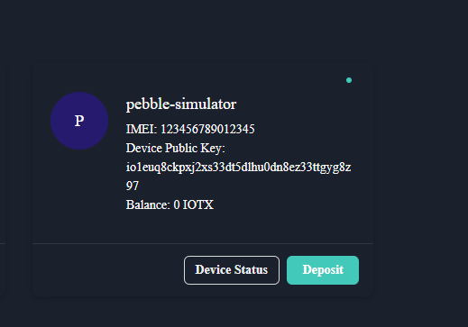
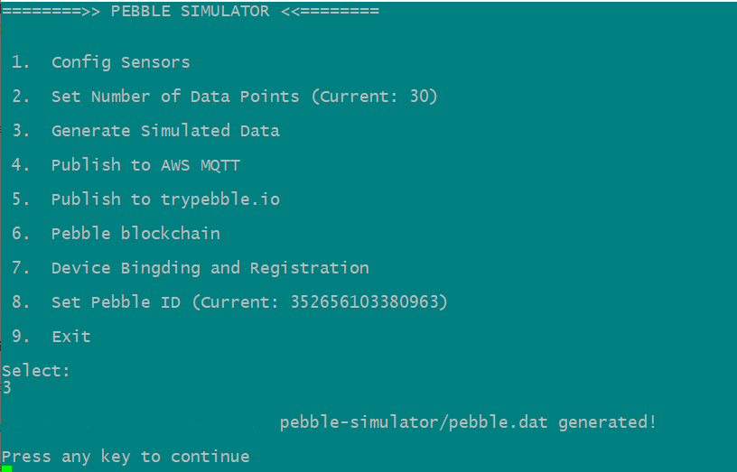
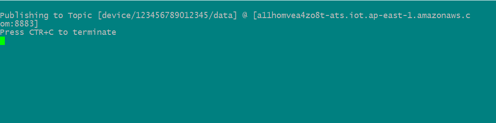

# pebble-simulator
The simulator for producing pebble data, write it to a local file and publish to AWS MQTT.

## Dependencies
- linux bash
- openssl 1.0.2g or later
- mosquitto-clients
- libcurl
### Ubuntu
`apt-get install  openssl`

`apt-get install  mosquitto-clients`

### MacOS
`brew install openssl`

`brew install mosquitto`
## Run
`./simulator.sh`

```
========>> PEBBLE SIMULATOR <<========


 1.  Config Sensors

 2.  Set Number of Data Points (Current: 30)

 3.  Generate Simulated Data

 4.  Publish to AWS MQTT

 5.  Publish to trypebble.io

 6.  Pebble blockchain

 7.  Device Bingding and Registration

 8.  Set Pebble ID (Current: 352656103380963)

 9.  Exit

Select:

```
This, by default, produces 30 data points for all 8 sensors at random. The output is written to pebble.dat which looks like below.
```
{"message":{"SNR":187,"VBAT":4.36002,"gas_resistance":1173,"temperature":16.21609,"pressure":515.32678,"humidity":31.51630,"temperature":76.22284,"gyroscope":[6,-1214,8],"accelerometer":[937,1214,1491],"timestamp":"85000"},"signaturer":{"r":"00fb7f17b6f524a684ac392eb47761bd1f994fd0a1f92d227a263e3ea981d2007e02204","s":""}}
```
###  Add a device to the portal
1. Run simulator and select '8' in the main menu to configure the device ID



2. Select '7' in the main menu to put the simulator into a wait-and-add state. Add devices on the protal page (https://web-pebble-frontend.vercel.app/) at the same time 
  


Add a device to the portal:



3. The device was added successfully


The device has been added to portal



### Upload data to portal
1. Generate simulated data 
   
Select '3' in the main menu to generate simulated data



2. Select '4' to upload data in the main menu



3. You can view the data in portal

It has been successfully tested on Ubuntu 16.04.6 and MacOS 10.14

## Files
`simulator.sh` - The simulator

`pebble-firmware-blockchain.sh`  -  Blockchain interactive interface, RSA encryption and decryption

`configure.sh`  -  A tool for configuring pebble devices

`pebble.dat` - The data points produced according to the spec

`tracker01.key` - ECDSA key used by the simulator to sign data

`cert.pem` - the cert for communicating via MQTT, which can be downloaded while creating `AWS IoT things`

`private.pem` - the private key for communicating via MQTT, which can be downloaded while creating `AWS IoT things`

`AmazonRootCA1.pem` - AWS's root CA cert.

`pebble_contract_linux`  -  Linux version of blockchain interactive program

`pebble_contract_darwin`  -  MacOS version of the blockchain interactive program
