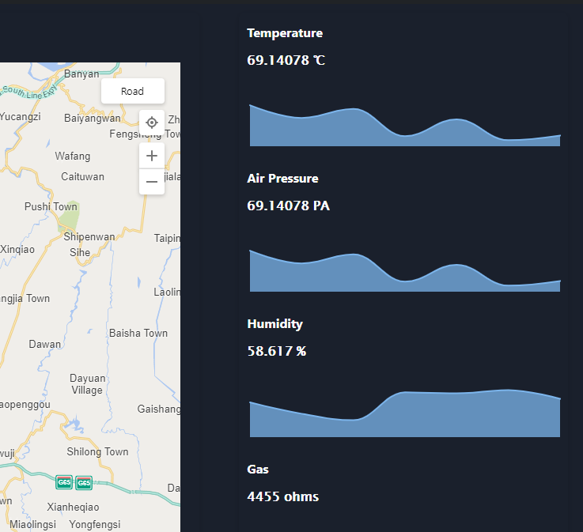

# pebble-simulator
The the script for simulating pebble to produce signed data, write it to a local file and publish to AWS MQTT. 

It has been successfully tested on Ubuntu 16.04.6 and MacOS 10.14


## Dependencies
- linux bash
- openssl 1.0.2g or later
- mosquitto-clients
- libcurl
- python3 / secp256k1
- pkg-config
- autoconf
- libtool
- automake

### Ubuntu
`apt-get install  openssl`

`apt-get install  mosquitto-clients`

`apt-get install  python3  pkg-config autoconf libtool automake`

`pip3 install secp256k1`

### MacOS
`brew install openssl`

`brew install mosquitto`

`brew install python3 pkg-config autoconf libtool automake`

`pip3 install secp256k1`
## Run
`./simulator.sh`

```
========>> PEBBLE SIMULATOR <<========


 1.  Config Sensors

 2.  Set Number of Data Points (Current: 30)

 3.  Generate Simulated Data

 4.  Publish to IoTT Portal

 5.  Publish to IoTeX Blockchain

 6.  Device Registration

 7.  Set Device IMEI (Current: 352656103380963)

 8.  Exit

Select:

```
By default, the scirpt produces 30 data points for all 8 sensors at random. The output is written to pebble.dat which looks like below.
```
{"message":{"SNR":187,"VBAT":4.36002,"gas_resistance":1173,"temperature":16.21609,"pressure":515.32678,"humidity":31.51630,"temperature":76.22284,"gyroscope":[6,-1214,8],"accelerometer":[937,1214,1491],"timestamp":"85000"},"signaturer":{"r":"00fb7f17b6f524a684ac392eb47761bd1f994fd0a1f92d227a263e3ea981d2007e02204","s":""}}
```

###  Register Device
1. Run simulator and select '7' in the menu to configure the device ID

2. Select '6' in the menu to put the simulator into a waiting state. 

3. Add devices on the protal page (https://portal.iott.network/) at the same time 


4. Make sure the device is added successfully.


The device has been added to portal


### Produce and Upload Data
1. Generate simulated data 
   
Select '3' in the main menu to generate simulated data


2. Select '4' to upload data in the main menu


3. You can view the data in portal
   



## Files
`simulator.sh` - The simulator

`pebble-firmware-blockchain.sh`  -  Blockchain interactive interface, RSA encryption and decryption

`configure.sh`  -  A tool for configuring pebble devices

`pebble.dat` - The data points produced according to the spec

`privKey` - ECDSA private key used by the simulator to sign

`pubKey`  - ECDSA publickey key used by the simulator to verify signature

`cert.pem` - the cert for communicating via MQTT, which can be downloaded while creating `AWS IoT things`

`private.pem` - the private key for communicating via MQTT, which can be downloaded while creating `AWS IoT things`

`AmazonRootCA1.pem` - AWS's root CA cert.

`pebble_contract_linux`  -  Linux version of blockchain interactive program

`pebble_contract_darwin`  -  MacOS version of the blockchain interactive program
